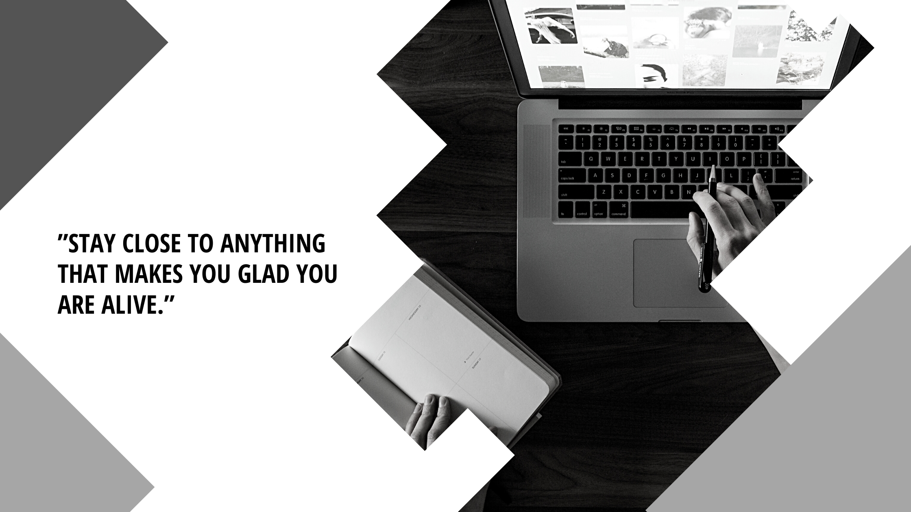

### Hi there, it's Al 👋

 

### About Me

- 🔭 I’m currently working on 50 Projects in 50 days and refactoring code.
- 🌱 I’m currently learning MySQL and Sequelize.
- 👯 I’m looking to collaborate on Responsive Web Design with HTML, CSS & JavaScript.
- 💬 Ask me about front-end web design with CSS.
- 📫 How to reach me: Email me at almurawski15@gmail.com and connect with me on LinkedIn at https://www.linkedin.com/in/alexandra-murawski-8a312769/
- 😄 Pronouns: She/Her
- ⚡ Fun fact: Outside of programming, I'm a Pilates/Barre Fitness instructor.

### Portfolio

https://almurawski15.github.io/portfolio/

### Stats

### Languages

